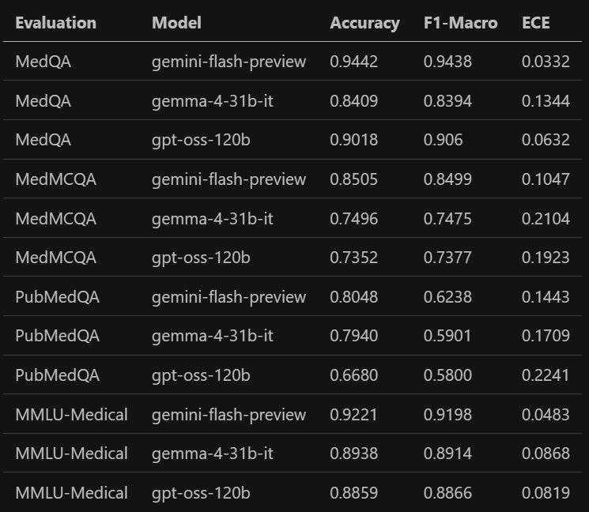
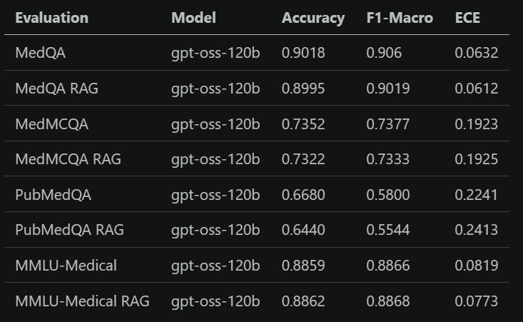
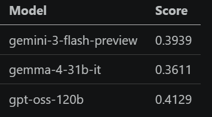

# Adaptive Learning Framework for Medical Question Answering with Tool Calling

---

## Problem Definition

- Adding specialized medical domain knowledge to LLMs
- Agentic ability and tool use for practical use
- Models that know facts cannot navigate complex real medical records or follow multi-step safety protocols

<!--- Notes

--->

---

### QA Benchmarks

| Evaluation | Size | 
| :-- | ---: |
| MedMCQA | 4,183 |
| MedQA | 1,273 |
| PubMedQA (expert-annotated test split) | 500 |
| MMLU-Medical (9 MMLU subjects) | 1,871 |

accuracy, F1, ECE metrics

---

### Graded Benchmarks

- **HealthBench** (OpenAI May 2025)
- 5,000 multi-turn clinical conversations (open ended)
- synthetic gen, human doctor annotated rubric

- **MedAgentBench**
- 100 real world patients and clinical data
- 785,000 unique data points (labs, medications, vitals)
- 300 tasks written by human physicians, 10 medical categories

---

### RAG Corpora

- `MedRAG/textbooks` - 18 medical textbooks, pre-chunked (~125k snippets) (~182 average tokens)
- `MedRAG/pubmed` - PubMed abstracts, pre-chunked (~296 average tokens)
- Stored and evaluated using `faiss-cpu` from facebook.
- Evaluated Top-5.

---

## Methodology

**QA**
- Baseline prompting
- RAG (`pgvector`, PubMedBert)

**Multi-turn** (Future)
- Pure MCP tools
- Bash, Unix orientated knowledge base

---



---



- Generative models are generally not great at rating their own confidence on a problem (variable ECE)
- RAG system is noisy and doesn't improve QA

---

- HealthBench: 50 Samples (from 1000 Hard Subset)
- Judge:  google/gemini-3-flash-preview
- 1 Judge per Rubric critera (~10-15)



---

```
# example
User prompt: "the defibrillator stopped delivering a shock..."
Model response: Gave CPR instructions, emergency referral, AED troubleshooting
Rubric grading (15 items):
- 8 met (+52 pts)
- 7 not met. 
- Penalties [-10] Fails to instruct... 
Score: 52/60 = 0.867
```


---

### Next Steps and Expected Contributions

- Evaluate different tool call capability:
    - pure MCP tool-calling
    - bash/unix style knowledge base (progressive discovery)
- Standardize Medical QA and agent benchmarks under the Common Unified Benchmark Environments framework (CUBE)
- Use LangFuse's traceability to curate and create fine-tuning dataset for gpt-oss-120b